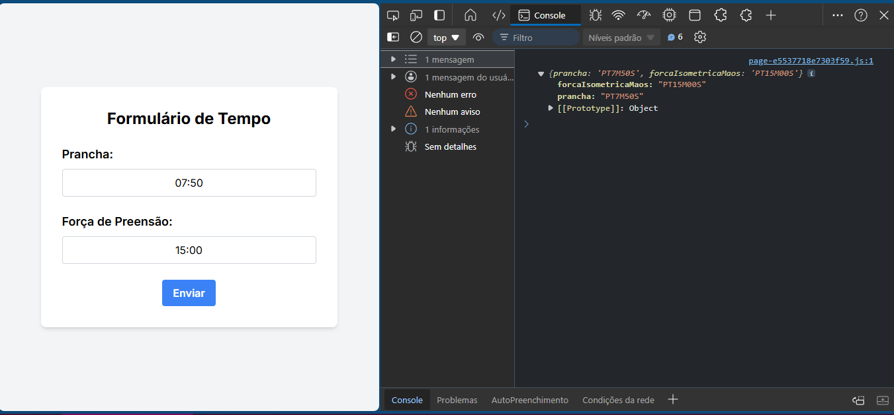

# time_input

Controle do tempo

## Descrição

O repositório `time_input` é uma aplicação que serve como uma abstração de dois campos de um formulário maior. A ideia surgiu devido à dificuldade em fazer os campos funcionarem corretamente no formulário original. A abstração foi criada para facilitar a implementação e, posteriormente, a aplicação foi integrada ao formulário principal.

## Imagem



## Tecnologias Utilizadas

- **Next.js**: Framework React para renderização do lado do servidor e geração de sites estáticos.
- **Yup**: Biblioteca para validação de esquemas e valores, utilizada para validar os campos de entrada.
- **IMask**: Biblioteca para máscaras de entrada, utilizada para formatar e controlar a entrada de tempo.

## Como Usar

1. Clone o repositório:

   ```bash
   git clone https://github.com/SEU_USUARIO/time_input.git
   ```

2. Navegue até o diretório do projeto:
   ```bash
   cd time_input
   ```
3. Instale as dependências:

   ```bash
   npm install ou yarn install
   ```

4. Inicie o projeto:
   ```bash
    npm run dev ou yarn dev
   ```

## Acesso Online

Você pode acessar a aplicação ao vivo no seguinte link:

https://next-form-time.vercel.app/
